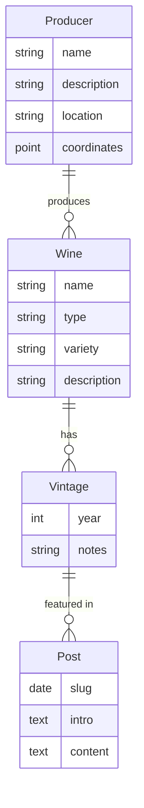

# CLAUDE.md

This file provides guidance to Claude Code (claude.ai/code) when working with code in this repository.

## Project Overview

Ball is Wine is a creative writing project combining wine tasting with basketball watching. Each month, the author watches basketball games, drinks a bottle of wine, and writes about both experiences. The blog is organized chronologically with entries containing two parts: basketball reflections and wine tasting notes.

The project is currently expanding to include a "cellar" feature to better catalog wines by producer and type.

## Tech Stack

- **Framework**: [Astro](https://astro.build/)
- **Content**: MDX for enhanced markdown
- **Styling**: TailwindCSS
- **Node.js**: v22

## Project Structure

- `/src/content/days/`: Contains chronological entry metadata files (YYYY-MM-DD.md)
- `/src/content/thoughts/`: Contains actual content with subdirectories by date:
  - `ball.md`: Basketball reflections
  - `wine.mdx`: Wine tasting notes with imported image
- `/src/pages/`: Route definitions (including dynamic routes)
- `/src/components/`: Reusable UI components
- `/src/layouts/`: Page layout templates
- `/memory-bank/`: Contains project documentation and specs

## Common Commands

```bash
# Install dependencies
npm install

# Development
npm run dev          # Start dev server at localhost:4321

# Type checking
npm run typewatch    # Watch for type errors
npm run check        # Run type check, format check, and lint

# Formatting & Linting
npm run fmt          # Format code with Prettier
npm run fmt:check    # Check formatting
npm run lint         # Run ESLint

# Building
npm run build        # Build site to ./dist/
npm run preview      # Preview built site locally

# Other
npm run cf:wip       # Commit with "[CF-Pages-Skip] WIP" and push
```

## Content Structure

Content is organized in a specific way:

- Each blog entry has a date-based ID (YYYY-MM-DD)
- The `/content/days/` directory contains references to corresponding thought content
- Actual content is stored in `/content/thoughts/{date}/` with separate files for:
  - `ball.md`: Basketball content
  - `wine.mdx`: Wine content with imported bottle image

## Cellar Features

The cellar section (currently in development) provides a structured catalog of wines with:

- Wine explorer page with chronological list of wines tried
- Wine detail pages with vintage information and tasting notes
- Producer list with geographic visualization
- Producer detail pages with all wines from that producer

### New Data Domain



## Styling Guidelines

- Prefer Tailwind v4 directives via class attribute over style tags when styling; style tags are still acceptable when styling requires complex selectors

## Code Guidelines

- MUST follow style and linting guidelines per eslint.config.js, tsconfig.json, and .prettierrc