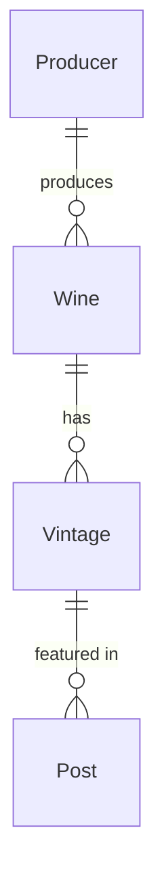

Goal is to move from the current content collections, `days` and `thoughts`, to the model
described here:

I've already transformed the 2024-10-22 post to the new model

The transform is, roughly:

- Producer: sourced from the wine.mdx files of the thoughts collection
- Wine: sourced from the wine.mdx files of the thoughts collection
- Vintage: sourced from the wine.mdx files of the thoughts collection
  - existing wine images should be ported to their new vintage entries

this data is found unstructured, inconsistently, in thoughts

- Posts: made up of 2 parts:
  - intro: sourced from the days collection
  - body: sourced from ball.md files of the thoughts collection

Some data in the new model does not exist in the old; do not solve for this, I will manually enter

- Producer
  - main content of the new .md file
  - location
  - coordinates
- Wine
  - hue
- Vintage:
  - cepage (some files have this, but it's missing, for the most part)
