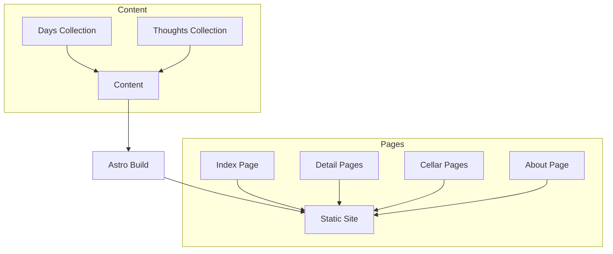
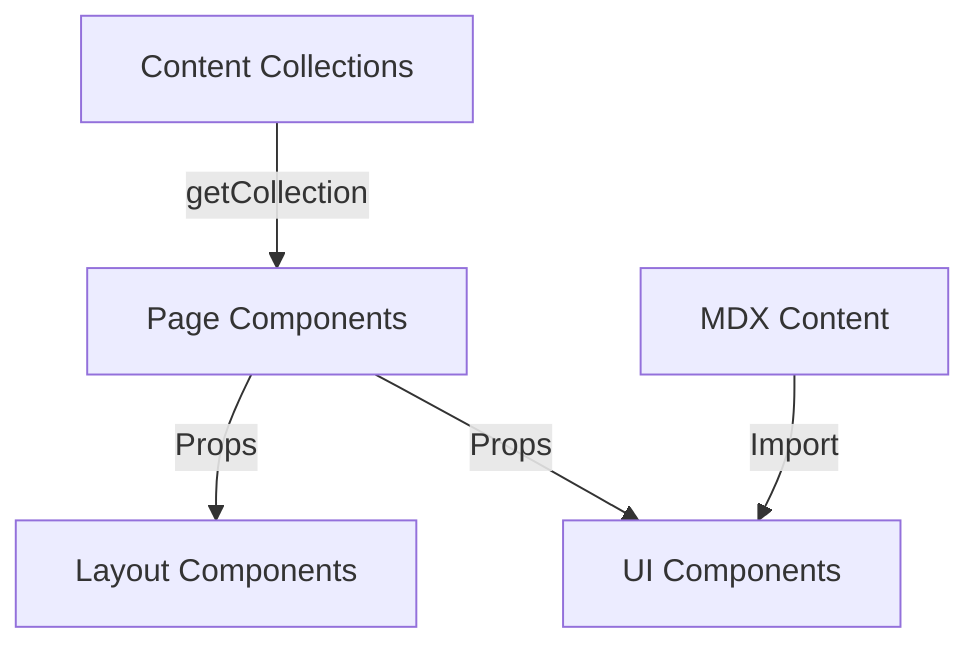

# System Patterns

## Architecture Overview

Ball is Wine follows a content-focused architecture built with Astro, emphasizing static site generation for performance and simplicity.



## Content Organization

The content follows a date-based organization pattern:

```text
src/
├── content/
│   ├── days/
│   │   ├── YYYY-MM-DD.md (date entries)
│   │   └── ...
│   └── thoughts/
│       ├── YYYY-MM-DD/
│       │   ├── ball.md (basketball thoughts)
│       │   ├── wine.mdx (wine thoughts)
│       │   └── [wine-image].png (wine bottle image)
│       └── ...
```

This structure allows for:

- Clear organization by date
- Separation of concerns between basketball and wine content
- Co-location of related assets (images) with content
- Flexible content types (markdown and MDX)

## Key Design Patterns

### Content Collections

Astro's content collections are used to manage structured content:

1. **Days Collection**: Simple date entries that serve as the main navigation points
2. **Thoughts Collection**: Detailed content organized by date, with separate files for basketball and wine

This approach provides type safety and structured querying of content.

### Component Architecture

The site uses a component-based architecture with clear separation of concerns:

1. **Layout Components**: Shell and typography components that provide consistent structure
2. **UI Components**: Reusable UI elements like Logo and Subnav
3. **Detail Components**: Specialized components for specific content types (wine-block, tabs)

### Routing Pattern

The site uses Astro's file-based routing with dynamic routes:

1. **Static Routes**: `/`, `/about`, `/cellar`
2. **Dynamic Routes**: `/[...slug]` for date-based content pages

### Styling Approach

The project uses Tailwind CSS with a consistent design language:

1. **Color Palette**: Warm colors (amber, yellow, rose) that evoke wine themes
2. **Typography**: Custom font families for different content types
   - `font-title` for headings and emphasis
   - `font-sans` for body text
3. **Responsive Design**: Mobile-first approach with responsive adjustments

## Data Flow



## Implementation Patterns

### Content Rendering

1. **Collection Queries**: Pages query collections to get content
2. **Date Formatting**: Consistent date formatting using utility functions
3. **MDX Integration**: Enhanced markdown with component imports

### Navigation

1. **Chronological Navigation**: Main page lists entries by date in reverse chronological order
2. **Categorical Navigation**: Cellar page provides wine-specific navigation
3. **Consistent Header**: Subnav component provides consistent navigation across pages

### Asset Management

1. **Co-located Images**: Wine bottle images stored alongside content
2. **Optimized Images**: Astro's image optimization for performance
3. **External Resources**: Links to external content where appropriate
